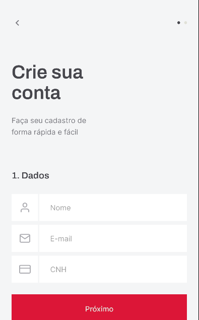
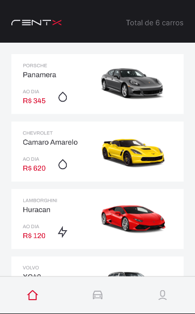
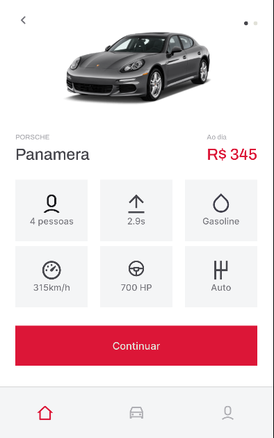
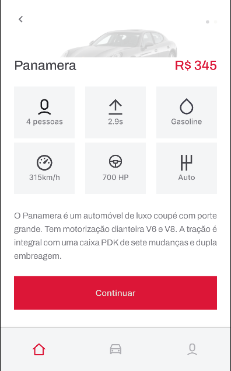
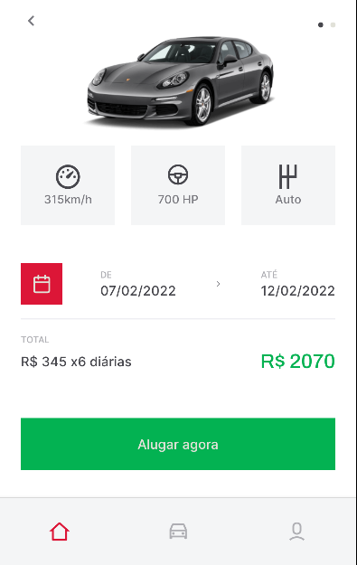

# rentx

## Requirements

- Package manager: Yarn/Npm;
- Expo CLI(https://docs.expo.io/workflow/expo-cli/);
- React Native(https://reactnative.dev/docs/getting-started);
## Steps

- Use yarn/npm to install dependencies;
- Start the app with: 'yarn start';
- Compatible plataforms :
  - Emulator:
    - Android Studio(https://developer.android.com/studio).

## Features

- Sign In;
- Sign Up;
- Show car list;
- Rent a car;
- Show rented cars;
- Show profile;
- Update profile avatar, name and CNH;

## Screenshots

### Login

### SignUp

### Home

### Car

### My cars

### Profile

